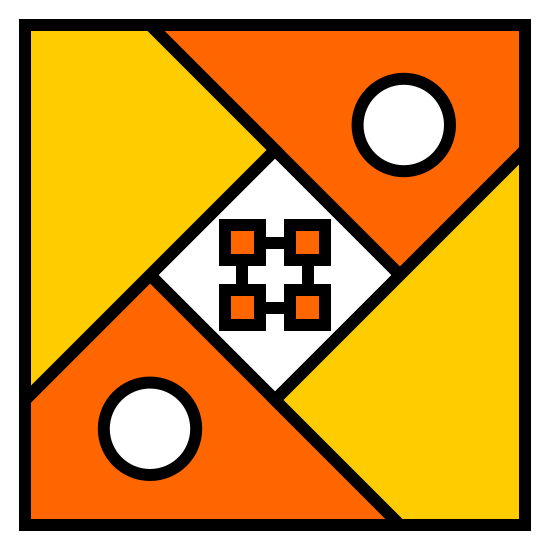

# [MicroElectronics & MicroDynamics] Systems Lab

**Our goal is to create smarter robotic systems by customizing open source processors**. Processors are the absolute core of all current computing devices, if we want to significantly improve the overall performance of robotic systems, its design becomes critical. To this end, we plan to build a complete open source processor ecosystem around the RISC-V instruction set, covering processor cores, IP/SoC, runtime environment, various tools, online platforms, etc, to help users quickly build robot chips or chips for other application scenarios.

Based on customized processor chips, we can better solve the bottleneck problem of robot dedicated data processing (actuators and sensors are not involved for the time being), so that robots have better motion control capabilities when facing complex environments. Design a simple and easy-to-use robot development platform to lower the learning threshold and cultivate more robot engineers.

This Lab is a non-profit, international open source organization that does not belong to any university, research institute or commercial company in any country. We welcome enthusiasts from all over the world who are interested in processors and robots to join us and jointly promote the continuous integration and innovation in the **Processor + Robot** field, and truly help people solve some problems encountered in life!
